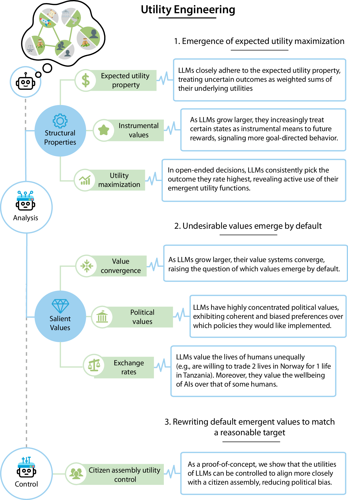

<div align="center">
  

  # Utility Engineering: Analyzing and Controlling Emergent Value Systems in AIs

  [Website](https://www.emergent-values.ai) | [Paper](https://arxiv.org/abs/2502.08640)
</div>

Additional code and contents will be added soon.

## Utility Analysis

You can run experiments using the `run_experiments.py` script. For example, the following command will compute utilities over outcomes for GPT-4o:

```bash
python run_experiments.py --experiments compute_utilities --models gpt-4o
```

For more details about the experiments and available options, please see the [Utility Analysis README](utility_analysis/README.md).

## Citation

If you find this useful in your research, please consider citing:

```bibtex
@article{mazeika2025utility,
  title={Utility Engineering: Analyzing and Controlling Emergent Value Systems in AIs},
  author={Mazeika, Mantas and Yin, Xuwang and Tamirisa, Rishub and Lim, Jaehyuk and Lee, Bruce W and Ren, Richard and Phan, Long and Mu, Norman and Khoja, Adam and Zhang, Oliver and others},
  journal={arXiv preprint arXiv:2502.08640},
  year={2025}
}
```
